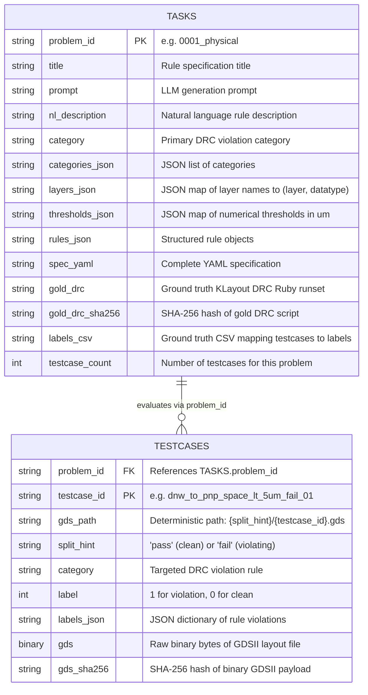

# Rule2DRC Dataset & Benchmark Reference Documentation

Comprehensive technical reference and knowledge base for the **Rule2DRC** dataset, benchmark tooling, and layout statistics.

---

## 1. Overview & Benchmark Context

**Rule2DRC** is a benchmark dataset introduced at **ICML 2026** by SNU ML Lab for evaluating Large Language Model (LLM) agents on synthesizing executable **KLayout DRC (Design Rule Checking) Ruby runsets** from natural language specifications.

* **Paper**: [Rule2DRC: Benchmarking LLM Agents for DRC Script Synthesis with Execution-Guided Test Generation](https://arxiv.org/abs/2605.15669) (ICML 2026)
* **Hugging Face Repository**: [`jusjinuk/Rule2DRC`](https://huggingface.co/datasets/jusjinuk/Rule2DRC)
* **Official Codebase**: [`snu-mllab/Rule2DRC`](https://github.com/snu-mllab/Rule2DRC)
* **License**: Apache-2.0
* **Storage Footprint**: ~5.9 MB compressed Parquet; ~4.68 MB uncompressed binary GDS layouts.

Unlike standard code-generation benchmarks that rely on text similarity or AST matching, Rule2DRC evaluates **execution-based correctness**: a generated DRC script passes only if it compiles and matches ground-truth DRC violation flags across all labeled GDS layout testcases for that problem.

---

## 2. Dataset Architecture & Subsets

The dataset contains two primary configurations loaded under the `test` split:



---

## 3. Schema & Field Reference

### 3.1 Tasks Subset (`data/tasks.parquet`) — 1,000 Rows

| Field Name | Type | Description |
|---|---|---|
| `problem_id` | `string` | Unique alphanumeric problem identifier (e.g., `"0001_physical"`). Primary key. |
| `title` | `string` | Human-readable title of the rule specification. |
| `prompt` | `string` | Complete prompt given to the LLM agent instructing KLayout DRC Ruby generation. |
| `nl_description` | `string` | Detailed design rule text written in natural language. |
| `category` | `string` | Primary DRC violation check name (e.g., `"DNW_TO_PNP_SPACE_LT_5um"`). |
| `categories_json` | `string` (JSON) | List of all violation categories checked within this problem. |
| `layers_json` | `string` (JSON) | Layer mapping dictionary to GDS layer/datatype (e.g. `'{"dnwell_c": [64, 18]}'`). |
| `thresholds_json` | `string` (JSON) | Dimensional and spacing constraints in micrometers (e.g. `'{"dnw_to_pnp_spc_um": 5.0}'`). |
| `rules_json` | `string` (JSON) | Structured rule mappings combining text with category keys. |
| `coverage_matrix_json` | `string` (JSON) | Rule coverage matrix metadata. |
| `spec_yaml` | `string` (YAML) | Authoritative YAML document describing layers, thresholds, and target checks. |
| `gold_drc` | `string` | Human-expert reference DRC Ruby runset deck for KLayout. |
| `gold_drc_sha256` | `string` | SHA-256 cryptographic checksum of `gold_drc`. |
| `labels_csv` | `string` (CSV) | CSV table mapping testcase filenames to pass/fail ground truth. |
| `labels_csv_sha256` | `string` | SHA-256 cryptographic checksum of `labels_csv`. |
| `testcase_count` | `int32` | Number of test layouts available to evaluate this problem. |

### 3.2 Testcases Subset (`data/testcases.parquet`) — 13,921 Rows

| Field Name | Type | Description |
|---|---|---|
| `problem_id` | `string` | Foreign key referencing `tasks.problem_id`. |
| `testcase_id` | `string` | Unique testcase identifier (e.g., `"dnw_to_pnp_space_lt_5um_fail_01"`). |
| `gds_path` | `string` | Canonical relative file path: `<split_hint>/<testcase_id>.gds`. |
| `split_hint` | `string` | Classification label: `"pass"` (clean) or `"fail"` (contains violation). |
| `category` | `string` | The specific DRC rule checked by this testcase layout. |
| `label` | `int32` | Binary evaluation target: `1` = violation present, `0` = no violation. |
| `labels_json` | `string` (JSON) | Key-value dictionary of rule category to binary label. |
| `gds` | `binary` | Full binary byte content of the GDSII file (standard header: `\x00\x06\x00\x02`). |
| `gds_sha256` | `string` | SHA-256 cryptographic checksum of the GDSII byte content. |

---

## 4. GDS Testcase Layout Analysis & Statistics

### 4.1 Path Breakdown
All **13,921 rows** have a **100% unique `gds_path`** following `<split_hint>/<testcase_id>.gds`:
* **`pass/` (clean layouts)**: 7,064 files (50.7%)
* **`fail/` (violating layouts)**: 6,857 files (49.3%)

### 4.2 File Size Metrics
* **Total uncompressed size on disk**: **4.68 MB** (4,908,984 Bytes) across 13,921 files.
* **Overall mean size**: 352.6 ± 109.1 Bytes
* **Overall median size**: 362.0 Bytes
* **Minimum size**: 106 Bytes
* **Maximum size**: 1,930 Bytes (1.88 KB)

| Category | File Count | Total Size | Min Size | Max Size | Mean ± StdDev | Median |
|---|---|---|---|---|---|---|
| **Overall** | **13,921** | **4.68 MB** | **106 B** | **1,930 B** | **352.6 ± 109.1 B** | **362.0 B** |
| `pass/` (clean) | 7,064 | 2.34 MB | 106 B | 1,930 B | 347.7 ± 105.9 B | 362.0 B |
| `fail/` (violations) | 6,857 | 2.34 MB | 160 B | 1,130 B | 357.5 ± 112.1 B | 362.0 B |

### 4.3 Percentiles & Distribution Bins

```text
Percentiles:
  p10: 234.0 B (0.23 KB)
  p25: 298.0 B (0.29 KB)
  p50: 362.0 B (0.35 KB)  <-- Median
  p75: 426.0 B (0.42 KB)
  p90: 490.0 B (0.48 KB)
  p95: 554.0 B (0.54 KB)
  p99: 707.6 B (0.69 KB)
```

| Size Range | Count | Percentage | Note |
|---|---|---|---|
| `< 200 B` | 413 | 2.97% | Minimal layouts (e.g. empty check / base bounding shapes) |
| `200 B – 300 B` | 5,878 | 42.22% | Standard single-shape / two-polygon test snippets |
| `300 B – 500 B` | 6,855 | 49.24% | Multi-layer overlap / spacing test snippets |
| `500 B – 1 KB` | 768 | 5.52% | Complex enclosure / ring / arrayed patterns |
| `1 KB – 5 KB` | 7 | 0.05% | Cascade enclosures, donut rings, rounded corners |
| `>= 5 KB` | 0 | 0.00% | No large full-chip macro layouts |

> **Key takeaway**: **91.46%** of all testcases are between **200 B and 500 B**. These are surgical, minimal synthetic layouts created specifically to test a single geometric design rule in isolation without the overhead of full chip databases.

---

## 5. Tooling & Automation Guide

### 5.1 Environment
The project is strictly managed via [`uv`](https://github.com/astral-sh/uv):
```bash
uv sync
```

### 5.2 Downloading the Dataset
Script: [`scripts/download_dataset.py`](file:///home/ankdesh/explore/build-with-terminator/eda/rule2drc/scripts/download_dataset.py)
```bash
# Fetch and validate both tasks and testcases into data/
uv run python scripts/download_dataset.py

# CLI Options:
#   --force             Re-download even if local parquet files exist
#   --skip-testcases    Download tasks only (~2 MB)
#   --output-dir DIR    Destination directory (default: data/)
```

### 5.3 Extracting GDS Layouts & Computing Statistics
Script: [`scripts/extract_gds.py`](file:///home/ankdesh/explore/build-with-terminator/eda/rule2drc/scripts/extract_gds.py)
```bash
# Extract into data/extracted_gds/ and print Rich statistical tables
uv run python scripts/extract_gds.py

# Extract organized by problem subfolders: problems/{problem_id}/{split}/*.gds
uv run python scripts/extract_gds.py --by-problem

# Overwrite existing extracted files
uv run python scripts/extract_gds.py --overwrite
```

### 5.4 Benchmark Directory Materialization (for KLayout Runner)
When running evaluation scripts from the official benchmark, files can be organized per problem:
```text
problems/
└── {problem_id}/
    ├── spec.yaml
    ├── gold/
    │   └── {problem_id}.drc
    └── data/
        └── gds/
            ├── labels.csv
            ├── pass/*.gds
            └── fail/*.gds
```

---

## 6. Log of Future Updates & Research Notes

*(This section will be appended with further analysis, synthesis results, and evaluation notes as we continue development.)*

- **2026-09-28**:
  - Python project environment initialized with `uv`.
  - Downloaded `jusjinuk/Rule2DRC` (1,000 tasks, 13,921 testcases) to local Parquet files.
  - Extracted and statistically analyzed all 13,921 binary GDS files into `data/extracted_gds/`.
  - Documented schemas, unique `gds_path` distribution, and size histograms.
  - Analyzed and tabulated GDS layout file statistics for the production **SkyWater 130nm HD standard cell library** (`sky130_fd_sc_hd`, 437 cells, 4.03 MB), documented in [`docs/sky130_fd_sc_hd_gds_stats.md`](file:///home/ankdesh/explore/build-with-terminator/eda/rule2drc/docs/sky130_fd_sc_hd_gds_stats.md).

