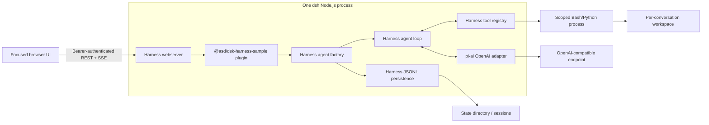
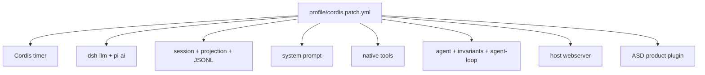
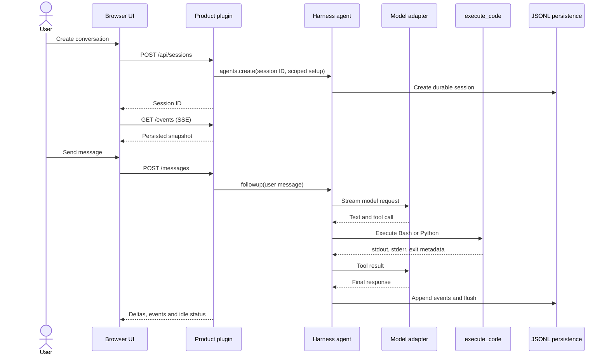
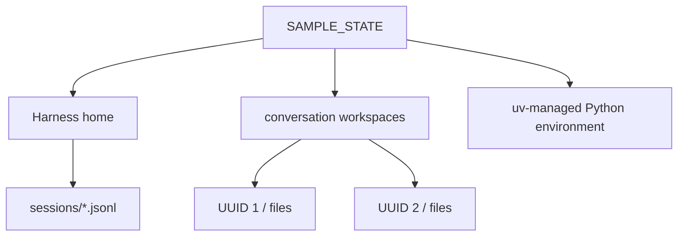
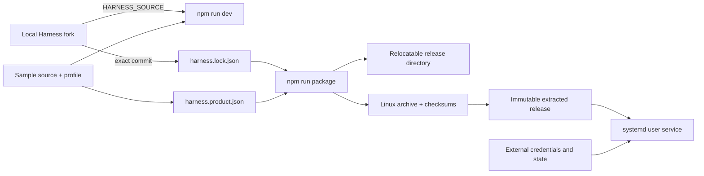
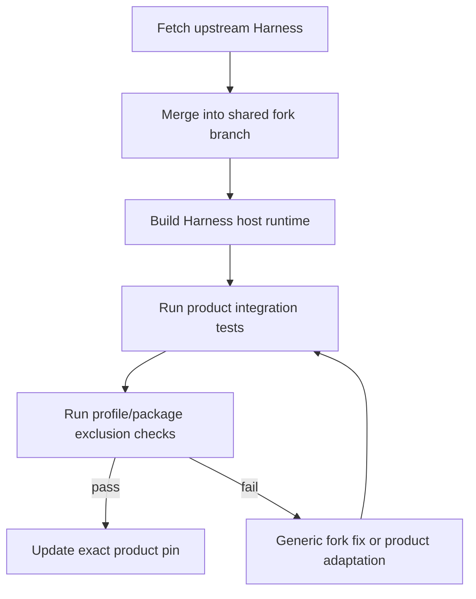

# ASD Harness sample architecture

## What this service demonstrates

ASD is a focused, standalone assistant built as a product plugin on DeepSeek
Harness. It demonstrates the runtime and distribution pattern intended for
larger products: Harness supplies the agent machinery, while the product owns
its API, UI, prompt, tools, state layout, and release definition.

The service does not depend on Spec Editor, Circuit Designer, or the existing
spec2gds AI Assistant. It is a mechanical reference for a future spec2gds
assistant, not a domain implementation. Its `execute_code` tool is deliberately
general for the sample and should not be copied into a focused spec2gds product.

## Runtime view

The product plugin mounts static assets and `/api` routes on the normal Harness
webserver. It creates or resumes agents through the public agent factory and
registers `execute_code` inside each agent's scoped setup. The normal Harness
loop invokes the model and tools; the product does not implement another loop.

## Ownership boundary

| Owner | Responsibilities |
| --- | --- |
| Harness fork | Generic profile preparation, local source linking and native packaging; upstream CLI, agent loop, tool pipeline, model adapter, sessions, JSONL persistence and HTTP host |
| Sample repository | Focused browser UI, authenticated chat API, event projection, execution tool, persona/profile, Python lock, product manifest, tests and deployment files |
| Operator | Model credential, external state location, release selection, service account and network exposure |

Product behavior stays in the product repository. A change belongs in the fork
only when it is generic enough for other products, such as dependency-closure
packaging or profile validation.

## Profile composition

The profile starts empty and inserts only the plugins that the service uses.

It omits the stock web and headless bundles, desktop application, DeepSeek
upload, terminal/filesystem plugins, browser automation, MCP, schedules and
other general product features. Some retained npm packages contain support for
more providers because they are transitive dependencies of pi-ai. Profile
selection controls activation; the packager separately trims the installed
artifact to the selected dependency closure.

## Conversation lifecycle

Only one turn may run for a conversation. A second message receives a conflict
response until the first becomes idle. Cancellation calls the Harness agent's
cancel API and waits for the running task to settle. The plugin streams text
deltas for responsiveness and persisted session events for authoritative tool
and final-message state.

## HTTP and event contract

The launcher generates an access token and places it in the printed local URL.
The browser sends it as a bearer token. The server uses constant-time token
comparison, rejects cross-origin requests, limits JSON requests to 64 KiB, and
serves assets with a restrictive content security policy.

| Endpoint | Purpose |
| --- | --- |
| `GET /healthz` | Reports that this process is ready |
| `GET /api/config` | Returns selected provider and model |
| `GET /api/sessions` | Lists persisted conversations |
| `POST /api/sessions` | Creates a UUID-backed conversation and workspace |
| `GET /api/sessions/{id}` | Returns a bounded persisted event snapshot |
| `GET /api/sessions/{id}/events` | Opens SSE, starting with a snapshot and current running state |
| `POST /api/sessions/{id}/messages` | Admits one user turn and returns 202 |
| `POST /api/sessions/{id}/cancel` | Cancels the active turn |

The event projection exposes user messages, assistant messages, tool calls,
tool results and turn completion. SSE also emits transient stream deltas,
errors and running status. On reconnect, the first snapshot repairs any event
missed while the browser was disconnected.

## Session and workspace state

Conversation IDs are UUIDs. On restart, `agents.resume` restores the Harness
session and the plugin re-registers the scoped tool for the same workspace.
The current implementation reads at most 2,000 events per snapshot and keeps at
most 20 resumed/created conversations in memory. Long-lived products need
history pagination and idle-handle eviction before increasing those limits.

## Execution boundary

`execute_code` accepts either a complete Bash program or Python program. It
runs in the conversation workspace using `/bin/bash --noprofile --norc` or the
uv-managed Python interpreter with isolated mode. It waits for the complete
process group and reports stdout, stderr, exit code, termination signal,
timeout, cancellation and output truncation separately.

The child environment removes credential-like variables and startup injection
variables such as `BASH_ENV`, `PYTHONPATH`, `NODE_OPTIONS`, and `LD_PRELOAD`.
Execution has a time limit and output byte limit. These controls bound a call;
they are not a filesystem, user, container, syscall, or network sandbox. The
service therefore listens on loopback and is intended for a trusted local user.

## Development and release paths

Development uses a sibling source checkout and the fork's product-profile
helper. Distribution verifies that Harness `HEAD` matches `harness.lock.json`,
then copies the actual selected production dependency graph plus product files.
The archive includes no source-checkout dependency and performs no JavaScript
installation on the target. Node, Bash, Python and uv are host prerequisites;
the provisioning script creates the external Python environment.

Releases are immutable. Credentials and writable state live outside the
release, so upgrading consists of unpacking and checking a new archive,
provisioning it, switching a `current` symlink, and restarting only this
service. Back up state before an upgrade; rolling back across a persistence
format change also requires a compatible state snapshot.

## Upstream maintenance model

The shared fork branch contains only reusable changes. A product may briefly
use a narrow compatibility branch, but product prompts, tools, UI and domain
adapters stay in its own repository. Every product owns its profile, lock,
release manifest and tests, allowing several products to consume the same fork
without coupling their release schedules.

## Verification and known limits

`npm test` includes unit tests for execution behavior and an integration test
that launches the real Harness CLI against a local OpenAI-compatible fixture.
It covers Bash/Python tool calls, streaming, authentication, persistence and
conversation reload after restart. The native artifact is also unpacked and
run from a different directory to verify relocation. A live model key is not
needed for these structural tests and model response quality is outside their
scope.

Before adapting this pattern to a production assistant, add product-specific
authentication, execution isolation if code execution remains, session
pagination/eviction, domain authorization, owner-service reconciliation, and
multi-version persistence tests.
