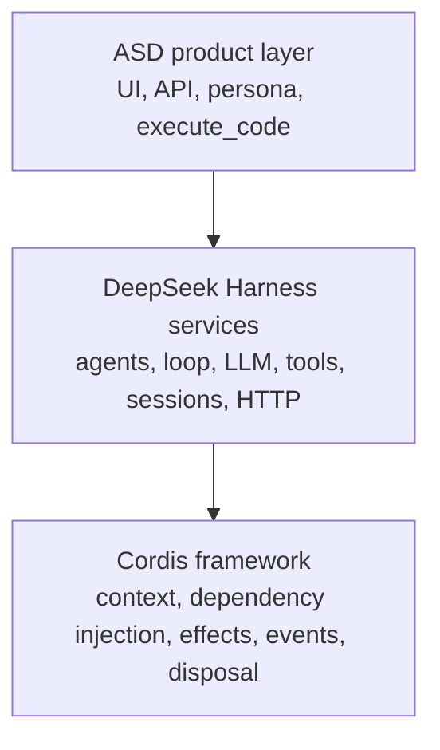
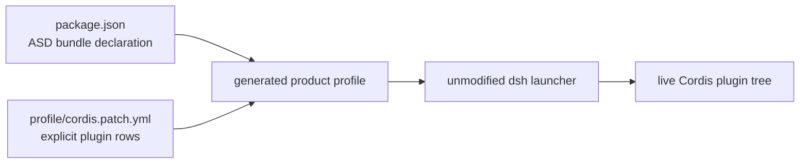
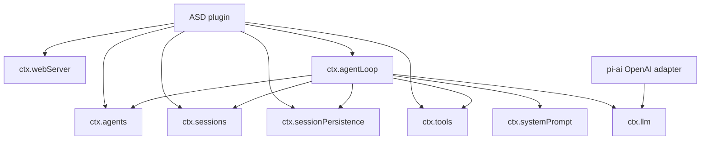
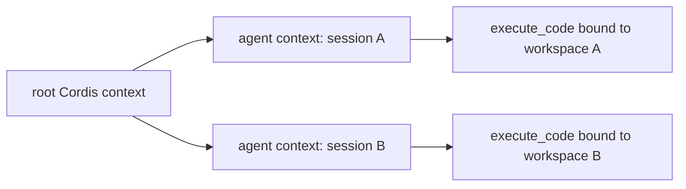
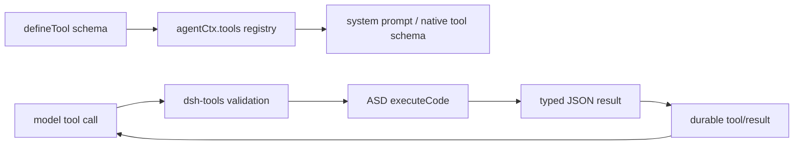

# ASD through Cordis and DeepSeek Harness

## Purpose

This document explains how the ASD sample is assembled from Cordis and
DeepSeek Harness components. It focuses on plugin composition, injected
services, runtime ownership, and the path of one conversation turn.

ASD is not a forked chatbot. It is a product plugin loaded into a deliberately
small Harness profile. Cordis provides the composition and lifecycle model;
Harness provides the agent, model, tool, session, persistence, prompt, and HTTP
services; ASD supplies the focused API, UI, execution capability, and product
policy.

The code discussed here is:

- `profile/cordis.patch.yml`: the complete plugin composition;
- `src/index.mjs`: the ASD Cordis plugin and product API;
- `src/execution.mjs`: the implementation behind the ASD tool;
- `scripts/dev.mjs`: local source-profile preparation and launch;
- `scripts/package.mjs`: native product packaging.

The pinned Harness revision is recorded in `harness.lock.json`.

## Three layers



### Cordis

Cordis is the plugin framework under Harness. A Cordis context is a registry of
services such as `ctx.agents`, `ctx.tools`, and `ctx.webServer`. A plugin:

1. declares required services through `inject`;
2. receives a scoped context in `apply(ctx, config)`;
3. registers routes, tools, and listeners as reversible effects;
4. is disposed together with everything registered in its scope.

This removes manual startup ordering. Cordis waits until all injected services
exist before activating ASD. It also gives each created agent a child context,
which ASD uses to install one workspace-bound tool without changing any other
agent.

### DeepSeek Harness

Harness packages are Cordis plugins and services implementing the agent
runtime. Their public seams are the `ctx.*` services and typed events. ASD uses
those seams instead of importing agent-loop or persistence internals.

### ASD

ASD is itself a Cordis plugin. It translates browser actions into the public
Harness agent API and translates Harness events into a small browser event
contract. It owns product behavior but delegates agent execution to Harness.

## How the profile is built

The package manifest declares ASD as a Harness bundle:

```json
{
  "dsh": {
    "bundle": {
      "patch": "./profile/cordis.patch.yml"
    }
  }
}
```

The development script asks the Harness fork's `product-profile.mjs` helper to
create a profile whose bundle list contains only `@asd/dsk-harness-sample`.
The profile root is empty; the ASD bundle patch inserts every runtime plugin.
The normal `dsh` launcher then loads this profile.



The profile uses startup-only loading. ASD has no plugin-management UI and does
not change its composition while running. Development relaunches after profile
or host-code changes; a release replaces the immutable application directory.

## Plugin inventory

The order below matches `profile/cordis.patch.yml`. Cordis dependency injection,
rather than list position alone, decides when a dependent plugin can activate.

| Profile row | Service or behavior | How ASD uses it |
| --- | --- | --- |
| `@deepseek-ai/cordis-plugin-timer` | Cordis timer service used by runtime components that schedule work | Infrastructure dependency. ASD also uses ordinary Node timers for SSE heartbeats and execution timeouts. |
| `@deepseek-ai/dsh-llm` | Provider-neutral `ctx.llm` model registry and streaming contract | Used indirectly by the agent loop. ASD uses its `createUserMessage` constructor to create a canonical Harness user message. |
| `@deepseek-ai/dsh-llm-pi-ai` | Registers configured pi-ai provider routes with `ctx.llm` | Defines the `openai` route, resolves `OPENAI_API_KEY` per request, and sends `OPENAI_MODEL` to the configured OpenAI-compatible endpoint. |
| `@deepseek-ai/dsh-session` | In-memory append-only sessions and derived model history through `ctx.sessions` | ASD flushes a session before reading snapshots. Agent creation and the loop append user, request, Assistant, tool, and turn events. |
| `@deepseek-ai/dsh-session-projection` | Registry for current values derived from committed session events | Required by the standard agent composition. ASD does not register a custom projection; its browser transcript is projected directly from persisted session events. |
| `@deepseek-ai/dsh-session-persistence-jsonl` | `ctx.sessionPersistence`, a durable per-session JSONL backend | ASD lists sessions, opens read handles, and relies on the agent loop's write handles. Compression is disabled so logs remain line-readable. |
| `@deepseek-ai/dsh-system-prompt` | `ctx.systemPrompt`, ordered prompt and tool-schema assembly | Supplies ASD's persona and automatically includes the registered tool schema. Harness identity and generic runtime context are disabled for this focused product. |
| `@deepseek-ai/dsh-tools` | `ctx.tools`, typed tool registry and execution pipeline | ASD registers `execute_code` in each agent scope. Native mode presents its schema directly through model function calling. |
| `@deepseek-ai/dsh-agent` | `ctx.agents`, live-agent registry and public handles | ASD calls `create`, `resume`, `followup`, `cancel`, `whenIdle`, and handle disposal. |
| `@deepseek-ai/dsh-invariants` | Runtime invariant registry | The registry is mounted, but this profile does not explicitly mount package `./invariant` companions. The registry alone installs no checks at the pinned revision. |
| `@deepseek-ai/dsh-agent-loop` | Standard driver behind `ctx.agents` | Creates/resumes sessions, assembles model requests, streams responses, dispatches tools, and appends durable events. `agents: []` means ASD creates agents programmatically; `maxParallelToolCalls: 1` serializes tool calls. |
| `@deepseek-ai/dsh-host-webserver` | Plain Node HTTP route service at `ctx.webServer` | Listens on `127.0.0.1:SAMPLE_PORT`. ASD registers its API, health route, and three static UI assets. |
| `@asd/dsk-harness-sample` | Product Cordis plugin | Owns authenticated browser routes, session-to-agent handles, SSE projection, the scoped execution tool, and shutdown coordination. |

## Service dependency graph



ASD declares these injected names:

```js
export const inject = [
  'webServer',
  'agentLoop',
  'agents',
  'sessions',
  'sessionPersistence',
  'tools',
]
```

`agentLoop` is injected as a readiness/lifetime dependency even though ASD does
not call methods on it. This guarantees that the concrete agent factory has
been mounted behind `ctx.agents` before ASD accepts requests. ASD does not
inject `llm` or `systemPrompt` because it never calls those services directly;
the loop owns those interactions.

## Cordis lifecycle in ASD

### Activation

Cordis parses ASD's `Config` schema using Schemastery and activates `apply`
only after the required services are present. `apply` creates process-local maps
for live handles, in-progress creations, running turns, and SSE subscribers.
It then installs routes and event listeners.

All registrations belong to the ASD plugin's Cordis scope:

- `ctx.effect(() => ctx.webServer.register(...))` mounts reversible routes;
- `ctx.on('session/event', ...)` observes committed session events;
- `ctx.on('agent/assistant-stream', ...)` observes transient streaming frames;
- `ctx.on('dispose', ...)` performs coordinated product shutdown.

### Agent-scoped composition

Each conversation receives its own agent context through the `setup` callback
passed to `ctx.agents.create` or `ctx.agents.resume`.



Calling `agentCtx.tools.register(...)` installs the same tool definition into
that agent's scope, with a different captured `cwd`. Disposing the agent handle
unwinds its scoped registration. One conversation can therefore never receive
another conversation's tool closure through the registry.

### Disposal

When Cordis disposes ASD, the plugin stops admitting work, ends SSE responses,
waits for pending creations, disposes every owned agent handle, waits for
running turns, and clears its maps. Cordis then unwinds registered routes and
listeners. The handle is important: it is the capability that owns exact agent
teardown; a bare agent lookup would not grant that ownership.

## Creating and resuming conversations

ASD gives every conversation a UUID. Creation calls:

```js
ctx.agents.create({
  sessionId: SessionId(id),
  meta: { cwd },
  agentOptions: { provider: 'openai', model },
  setup: setup(cwd),
})
```

Resume uses the same options and scoped setup with
`ctx.agents.resume({ resumeSessionId, ... })`. The agent loop acquires the JSONL
write handle, restores the session event stream, repairs an interrupted final
turn when required, recreates the driver, and publishes the live agent only
after setup succeeds.

ASD owns the returned `AgentHandle` for the process lifetime. Its `pending` map
deduplicates concurrent create/resume requests for one ID, and `handles`
prevents multiple live drivers for that conversation in this process.

## One message through the Harness stack

```mermaid
sequenceDiagram
    actor User
    participant UI as ASD browser
    participant P as ASD plugin
    participant A as ctx.agents / Agent
    participant Loop as dsh-agent-loop
    participant Prompt as dsh-system-prompt
    participant LLM as dsh-llm + pi-ai
    participant Tools as dsh-tools
    participant Store as JSONL persistence

    User->>UI: Send text
    UI->>P: POST /api/sessions/{id}/messages
    P->>A: followup(createUserMessage(...))
    A->>Store: append durable inbox/user events
    A->>Loop: wake driver
    Loop->>Prompt: assemble persona and tool schemas
    Loop->>LLM: stream(provider=openai, model=...)
    LLM-->>Loop: text deltas and/or tool call
    Loop-->>P: agent/assistant-stream deltas
    P-->>UI: SSE delta packets
    alt model calls execute_code
        Loop->>Tools: dispatch validated arguments
        Tools->>Tools: run ASD execute function
        Tools-->>Loop: finalized JSON result
        Loop->>Store: append tool call/result events
        Loop->>LLM: continue with tool result
    end
    LLM-->>Loop: final assistant stream
    Loop->>Store: append assistant/message and turn/end
    Store-->>P: session/event notifications
    P-->>UI: SSE persisted event packets
    P->>Store: flush durability barrier
```

ASD accepts only one running request per conversation. `followup` is synchronous
admission into the durable inbox; `whenIdle()` waits for the complete sequence
of model steps and tools to settle. The HTTP endpoint returns 202 immediately,
while status and content travel over SSE.

## The model path

`dsh-llm` defines a provider-neutral message and streaming vocabulary. The
agent loop builds a frozen request from session history, selected tools, and the
assembled system prompt. `dsh-llm-pi-ai` owns conversion to the configured
OpenAI wire protocol.

The ASD route is:

| Setting | Source | Effective value |
| --- | --- | --- |
| Provider route | Product plugin config | `openai` |
| Model | `OPENAI_MODEL` | `gpt-4o-mini` by default |
| API protocol | Profile | `openai-completions` |
| Endpoint | `OPENAI_BASE_URL` | `https://api.openai.com/v1` by default |
| Credential reference | Profile | `OPENAI_API_KEY`, resolved per request |

The API key is a reference, not a literal profile value. Harness reports stable
model-layer failures such as missing credentials or unknown models through its
LLM contract. ASD relies on the standard loop to record request and response
facts in the session.

## System prompt and tool exposure

The system-prompt plugin combines ASD's persona with the schemas of tools
visible in the active agent scope. ASD disables the stock Harness identity and
generic runtime-context block so the prompt begins with the focused product
persona.

The `dsh-tools` plugin runs in `native` mode. The model therefore sees
`execute_code` as a normal function with two validated fields:

- `language`: `bash` or `python`;
- `code`: a nonempty complete program.

`defineTool` declares the input and JSON output schema. Harness validates model
arguments before calling ASD and renders the returned JSON as a text block for
the next model request. The execution function receives Harness's cancellation
signal, which ASD passes to its child-process controller.



Harness owns schema visibility, dispatch, cancellation plumbing, and durable
tool events. ASD owns what the tool actually does: child process selection,
working directory, environment scrubbing, timeout, process-group termination,
output limits, and result fields.

## Sessions, projections, and persistence

These three plugins have separate roles:

1. `dsh-session` owns the in-memory append-only event log and derives the model
   message history.
2. `dsh-session-projection` can maintain current values folded from committed
   events. ASD mounts the service for standard composition but defines no
   product-specific projection unit.
3. `dsh-session-persistence-jsonl` stores and restores the event log on disk.

ASD's `project(event)` function is a browser DTO mapper, not a Harness session
projection. It selects five durable event types for the UI: `user/message`,
`assistant/message`, `tool/call`, `tool/result`, and `turn/end`. This distinction
matters: the Harness log stays authoritative, while the browser receives only
the fields it needs.

Before returning a snapshot, ASD calls `ctx.sessions.flush(session)`, opens a
read handle through `ctx.sessionPersistence`, reads a bounded event window, and
maps it. The SSE connection starts with such a snapshot, then receives committed
events from `session/event`. Transient `agent/assistant-stream` deltas improve
latency but are never the replay source; a reconnect repairs state from the
persisted snapshot.

Compression is set to `none`, trading disk size for inspectable JSONL. Harness
still owns format versions, migration, fsync behavior, write ownership, and
torn-tail recovery.

## HTTP hosting

The Harness webserver is intentionally a transport, not an application server.
It supplies route registration and lifecycle but no authentication, TLS,
session API, static-file policy, or origin policy. ASD implements those product
concerns.

ASD registers:

- a prefix route at `/api`;
- an exact `/healthz` route;
- exact routes for `/`, `/app.js`, and `/style.css`.

The product route checks its bearer token and same-origin rule, limits request
bodies, and serializes errors. The asset routes set content type, no-sniff, and
a restrictive content security policy. The webserver listens on loopback, so
remote use is expected to go through an SSH tunnel rather than direct public
exposure.

## Events ASD consumes

| Event | Producer | ASD use |
| --- | --- | --- |
| `session/event` | Session/agent runtime after a committed event | Convert relevant durable events to SSE packets |
| `agent/assistant-stream` | Agent loop during one model attempt | Forward `start` and text-delta frames for low-latency display |
| `dispose` | Cordis lifecycle | Stop admission and release subscribers, agents, and running work |

ASD does not infer truth from stream deltas. Complete Assistant content is
authoritative only after the loop commits `assistant/message` to the session.

## Components intentionally absent

The profile does not load the stock Harness web application or broad general
assistant bundles. It also omits stock Bash/filesystem/terminal tools, browser
and computer control, SSH, MCP, schedules, webhooks, plugin management,
settings UI, desktop/Electron, DeepSeek session upload, coding-agent bridges,
subagents, teams, and PTC execution.

ASD replaces only the product surface:

- its own HTML/CSS/JavaScript instead of the stock chat UI;
- its own REST/SSE API instead of the stock browser gateway;
- one product tool instead of the general tool suite;
- one fixed persona and provider route instead of user-facing settings.

It still uses the normal Harness core path beneath that surface.

## Current diagnostic note

`@deepseek-ai/dsh-invariants` is present, but invariant checks are contributed by
separate package companion entry points such as `@deepseek-ai/dsh-session/invariant`.
The current ASD profile does not list those companions. At the pinned Harness
revision, mounting the registry alone installs no checks.

For a production profile, make one explicit choice:

- add the invariant companions for the retained stateful packages and verify
  their artifact impact; or
- remove the unused registry row to keep the composition honest and smaller.

This should be decided by a profile test rather than assumed from the package
name.

## Extension rules for another focused product

When adapting ASD's pattern for spec2gds or another project:

1. Keep the ordinary `dsh` launcher and standard agent loop.
2. Express every retained Harness component in one explicit profile.
3. Put product routes, prompts, tools, UI, contracts, and policies in the
   product repository.
4. Register product tools in agent scope when they capture session-specific
   identity, authorization, or workspace state.
5. Use public `ctx.*` services and events; do not import loop internals.
6. Treat transient streaming as presentation and persisted session events as
   recovery truth.
7. Keep model-call tools non-mutating when owner data requires explicit human
   review; expose mutations through authenticated user-action routes instead.
8. Test the prepared profile and the packaged dependency closure separately.

The ASD sample proves that a focused product can reuse Harness's runtime while
owning a substantially smaller interface and release. It does not imply that
all product policy belongs in Harness or that every Harness package belongs in
the deployed artifact.
