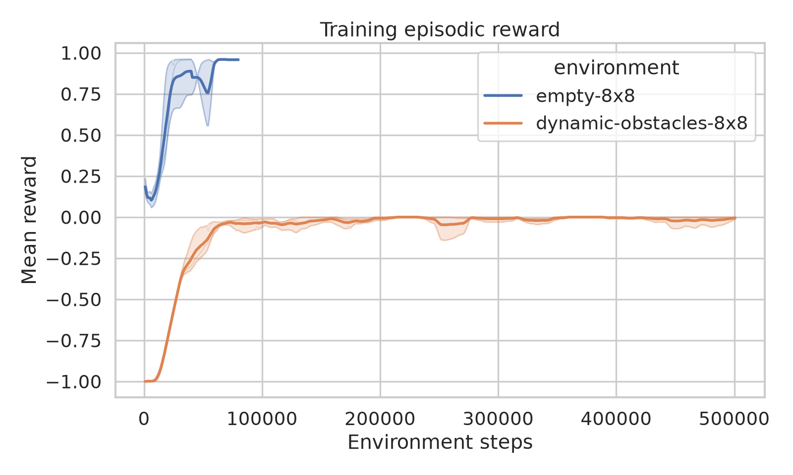
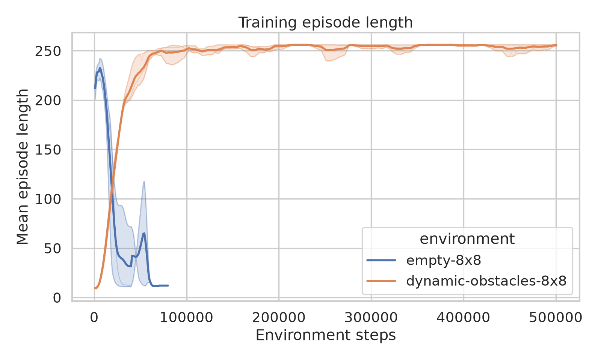
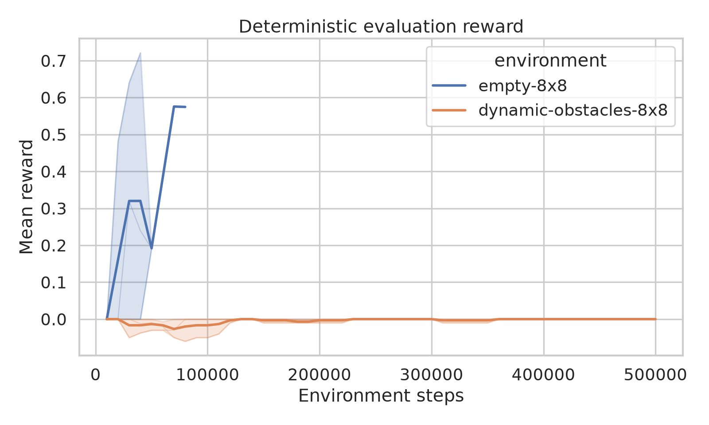
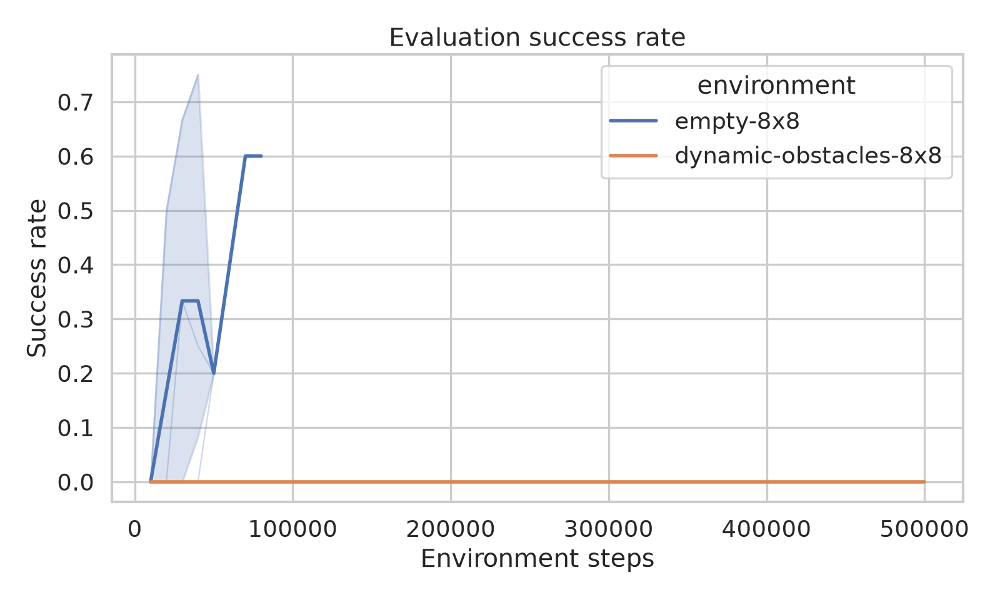
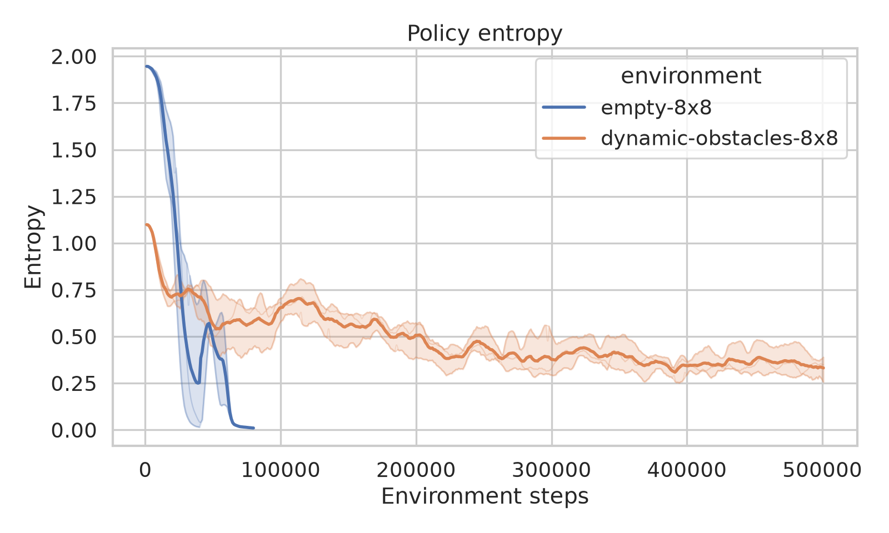
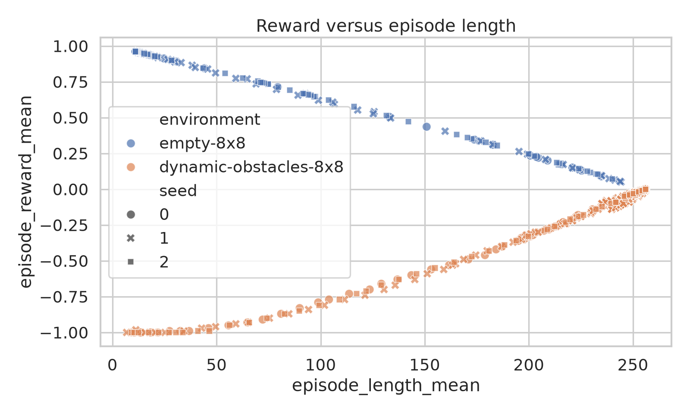
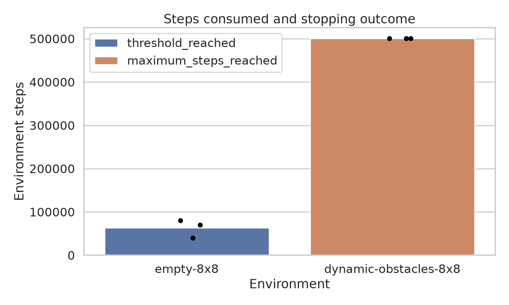
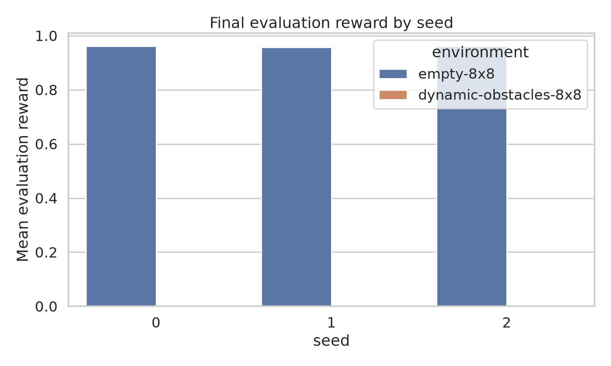
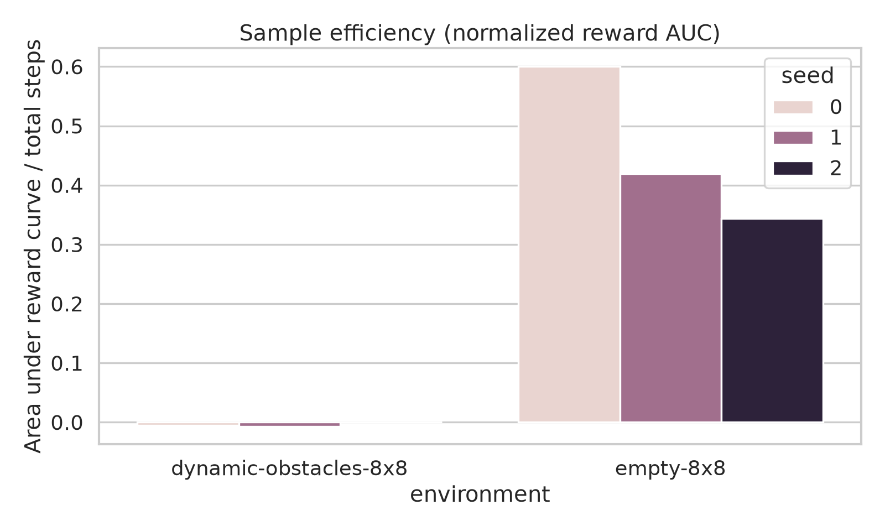
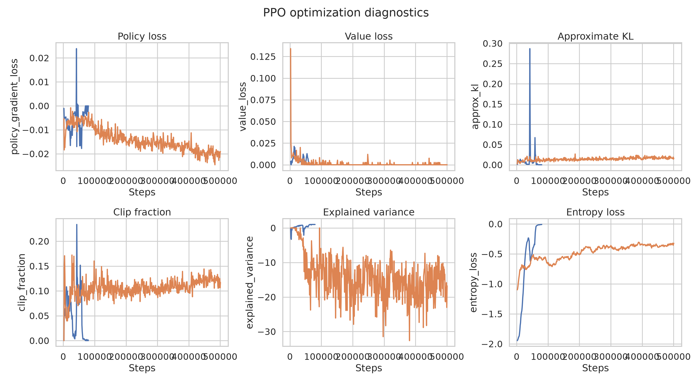

# Phase 1: Interactive MiniGrid PPO Baselines

This report compares PPO on `MiniGrid-Empty-8x8-v0` and
`MiniGrid-Dynamic-Obstacles-8x8-v0`. It is generated from saved CSV/JSON metrics,
so the report can be rebuilt without retraining.

## Experiment status

| Environment | Seed | Status | Steps | Best reward | Final reward | Time |
|---|---:|---|---:|---:|---:|---:|
| `MiniGrid-Dynamic-Obstacles-8x8-v0` | 0 | maximum_steps_reached | 500,736 | 0.0 | 0.0 | 42.6 min |
| `MiniGrid-Dynamic-Obstacles-8x8-v0` | 1 | maximum_steps_reached | 500,736 | 0.0 | 0.0 | 39.5 min |
| `MiniGrid-Dynamic-Obstacles-8x8-v0` | 2 | maximum_steps_reached | 500,736 | 0.0 | 0.0 | 42.3 min |
| `MiniGrid-Empty-8x8-v0` | 0 | threshold_reached | 40,000 | 0.9613280000000003 | 0.9613280000000003 | 2.9 min |
| `MiniGrid-Empty-8x8-v0` | 1 | threshold_reached | 80,000 | 0.957812 | 0.957812 | 5.8 min |
| `MiniGrid-Empty-8x8-v0` | 2 | threshold_reached | 70,000 | 0.9613280000000003 | 0.9613280000000003 | 4.9 min |

`threshold_reached` means the configured mean evaluation reward was met for three
consecutive evaluations. `maximum_steps_reached` means the bounded 500,000-step
run completed without that sustained result; it is not labeled as convergence.

## Learning curves



Higher reward indicates progress toward the goal. Seed traces are faint and the
aggregate curve includes a 95% confidence interval, exposing both learning speed
and run-to-run variability.



Successful policies usually shorten paths. In Dynamic Obstacles, longer or noisy
episodes can also reflect collision avoidance rather than simple inefficiency.



Periodic deterministic evaluation separates policy quality from exploration noise.



Success is an episode with positive MiniGrid reward. Compare this with reward:
two agents may both succeed while one reaches the goal by a shorter route.



Entropy measures action uncertainty. A gradual decline often accompanies learning;
an early collapse while reward remains flat can indicate premature convergence.

## Behavioral and convergence comparisons



This relationship helps distinguish efficient solutions (high reward, short episode)
from wandering or obstacle-induced delays.



Bars show training steps consumed, while color records why each run stopped.



Seed-level final reward reveals whether a result is robust or driven by one lucky run.



Normalized area under the evaluation-reward curve rewards agents that learn early,
not only agents with a strong final checkpoint.

## PPO optimization diagnostics



Approximate KL and clip fraction show update size; policy and value loss show the
optimization objectives; explained variance indicates how well the critic predicts
returns; entropy loss reflects exploration pressure. These are diagnostics, not
scores—interpret them alongside reward and success.

## Setup and reproducibility

- Python is managed by `uv` in `.venv`; dependencies are locked in `uv.lock`.
- `ImgObsWrapper` removes mission text and exposes the 7×7×3 symbolic image.
- SB3 transposes images to channel-first format, and `MiniGridCNN` extracts 128 features.
- Each environment uses seeds 0, 1, and 2; evaluation uses `seed + 10000`.
- Evaluation runs every 10,000 steps for 20 deterministic episodes.
- TensorBoard logs, checkpoints, and models live under `artifacts/phase1`.
- Aggregated source data for these figures is in [`data/`](data/).

## Commands

```bash
uv sync
uv run minigrid-learn smoke
uv run minigrid-learn train --all
uv run minigrid-learn report
uv run tensorboard --logdir artifacts/phase1
```

To re-evaluate a model:

```bash
uv run minigrid-learn evaluate \
  --env empty-8x8 \
  --model artifacts/phase1/empty-8x8/seed-0/best_model/best_model.zip
```
